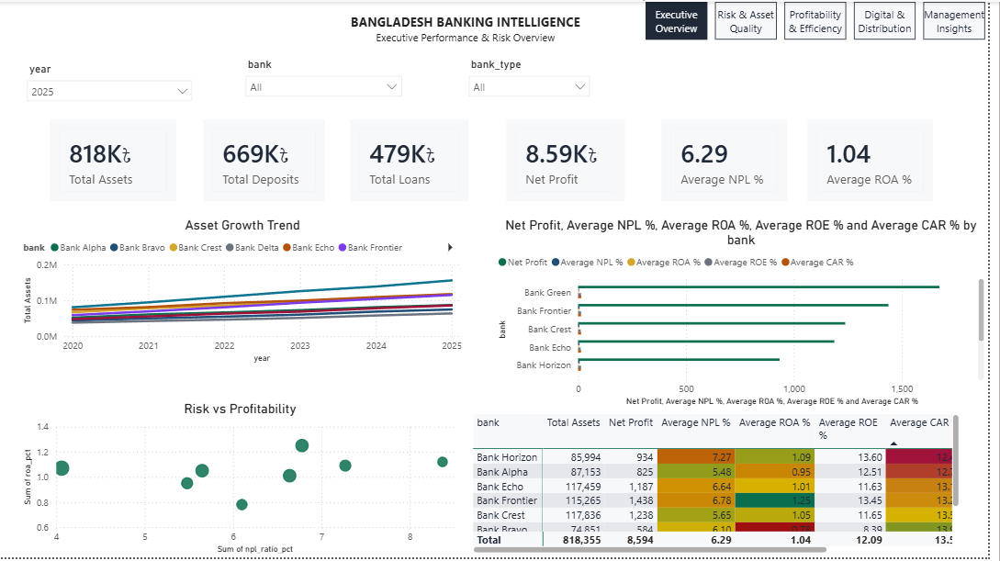
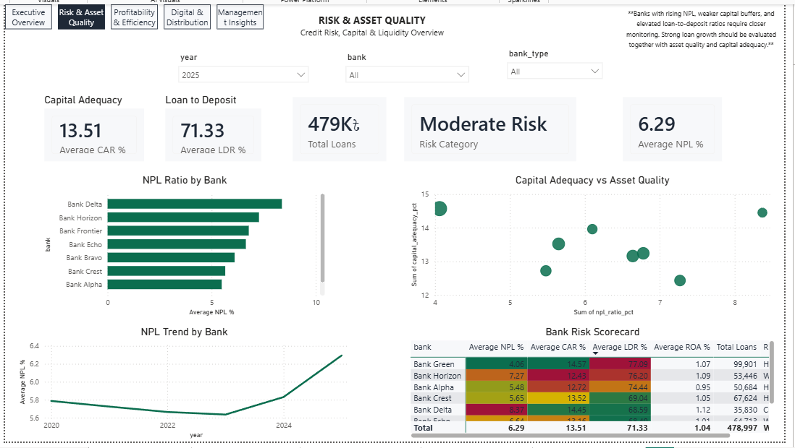
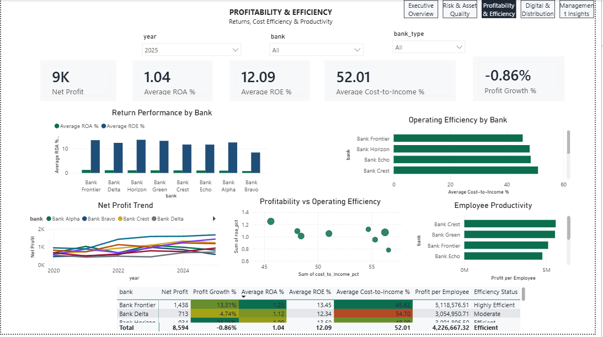
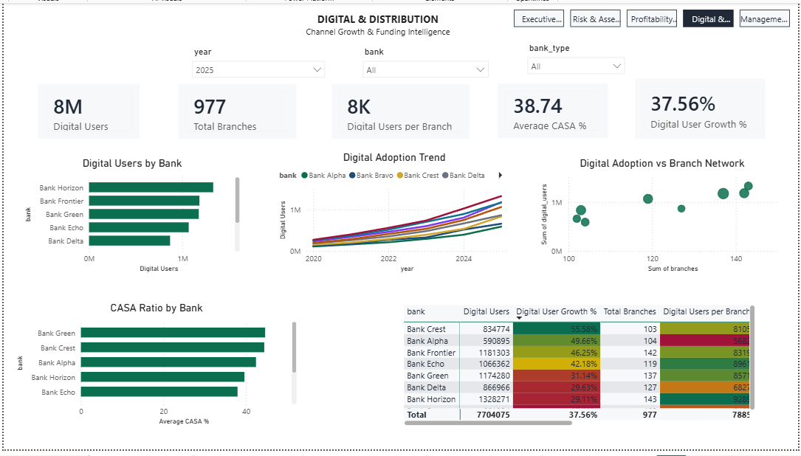
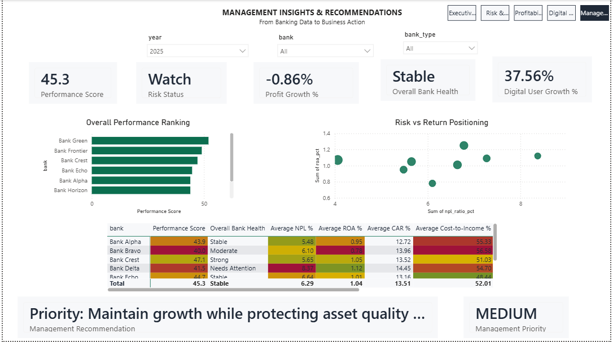

# Bangladesh Banking Intelligence Dashboard

A banking analytics and management intelligence project built with **Power BI, SQL, Python, DAX, and Excel** to analyze bank performance across profitability, asset quality, capital strength, operating efficiency, and digital transformation.

> **Note:** The bank-level financial data used in this project is **synthetic and fictional**, generated to resemble plausible commercial banking patterns. It does not represent the actual performance of any real Bangladeshi bank.

---

## 📊 Dashboard Preview

### 1. Executive Overview

Provides a high-level view of banking performance, including assets, deposits, loans, profitability, NPL ratios, and overall bank comparisons.



### 2. Risk & Asset Quality

Examines credit risk and financial stability through NPL ratios, capital adequacy, loan-to-deposit ratios, and bank-level risk positioning.



### 3. Profitability & Efficiency

Compares profitability and operational performance using net profit, ROA, ROE, cost-to-income ratios, profit growth, and employee productivity.



### 4. Digital & Distribution

Analyzes digital customer adoption, branch networks, CASA ratios, digital growth, and distribution efficiency.



### 5. Management Insights & Recommendations

Transforms analytical findings into management priorities by combining performance, risk, profitability, efficiency, and digital indicators.



---

## 🎯 Business Objective

The goal of this project is to answer management-level questions such as:

- Which banks demonstrate the strongest overall performance?
- Which banks show elevated asset-quality or credit risk?
- How do profitability and operating efficiency compare across banks?
- Are banks scaling digital channels faster than physical distribution?
- Which banks have stronger low-cost funding positions?
- What management actions should follow from the observed KPI trends?

The project focuses not only on **what happened**, but also on **why it matters and what management should do next**.

---

## 📈 Key Performance Indicators

| Area | KPIs |
|---|---|
| **Scale** | Total Assets, Deposits, Loans |
| **Profitability** | Net Profit, ROA, ROE |
| **Risk** | NPL Ratio, Capital Adequacy, Loan-to-Deposit Ratio |
| **Efficiency** | Cost-to-Income, Profit per Employee |
| **Funding** | CASA Ratio |
| **Distribution** | Branches, Digital Users |
| **Growth** | YoY Asset, Profit, Branch & Digital User Growth |
| **Management** | Performance Score, Risk Status, Management Priority |

---

## 💡 Management Insights

The dashboard is designed around several management principles:

- Rapid loan growth should be evaluated alongside **NPL trends and capital adequacy**.
- Higher profitability is more attractive when accompanied by **strong operating efficiency**.
- A rising cost-to-income ratio may indicate opportunities for **automation and cost optimization**.
- Strong CASA ratios can indicate a healthier **low-cost funding base**.
- Digital customer growth exceeding branch expansion may indicate improved **distribution scalability**.
- Strong financial growth should not come at the expense of **asset quality or capital resilience**.

---

## 🛠️ Tools & Technologies

- **Power BI** — Dashboard development and interactive visualization
- **DAX** — KPI measures, growth calculations, classifications, and decision logic
- **SQL / SQLite** — Banking analysis and window-function queries
- **Python** — Data preparation and exploratory analysis
- **Excel** — Supporting analytical dashboard
- **Git & GitHub** — Version control and project documentation

---

## 📂 Project Structure

```text
Bangladesh_Banking_Intelligence/
│
├── data/
│   ├── raw/
│   │   └── bank_financials_synthetic.csv
│   ├── processed/
│   │   └── bank_financials_enriched.csv
│   └── banking_intelligence.db
│
├── docs/
│   ├── screenshots/
│   │   ├── 01_executive_overview.PNG
│   │   ├── 02_risk_asset_quality.PNG
│   │   ├── 03_profitability_efficiency.PNG
│   │   ├── 04_digital_distribution.PNG
│   │   └── 05_management_insights.PNG
│   ├── KPI_DICTIONARY.md
│   ├── BUSINESS_CASE.md
│   └── INTERVIEW_TALK_TRACK.md
│
├── powerbi/
│   ├── DAX_measures.txt
│   ├── dashboard_layout.txt
│   └── theme.json
│
├── python/
│   ├── eda.py
│   └── requirements.txt
│
├── sql/
│   └── analysis_queries.sql
│
├── Bangladesh_Banking_Intelligence.pbix
├── Bangladesh_Banking_Intelligence_Dashboard.xlsx
├── README.md
└── LICENSE
```

---

## 🧠 Analytical Workflow

```text
Synthetic Banking Data
        ↓
Data Preparation
        ↓
SQL Analysis
        ↓
Python EDA
        ↓
Power BI Data Model
        ↓
DAX Measures
        ↓
Interactive Dashboard
        ↓
Management Insights
        ↓
Business Recommendations
```

---

## 🗄️ SQL Analysis

The SQL component includes analysis of:

- Latest-year bank performance
- Year-over-year asset growth
- Profitability vs risk
- High-NPL banks
- Digital adoption growth
- Operating efficiency
- Banking portfolio trends

Queries are available in:

```text
sql/analysis_queries.sql
```

The SQLite database is available at:

```text
data/banking_intelligence.db
```

---

## 🐍 Python Analysis

The Python component performs exploratory analysis and generates supporting visualizations.

To run:

```bash
python -m venv .venv
.venv\Scripts\activate
pip install -r python/requirements.txt
python python/eda.py
```

---

## 📊 Power BI Report

The Power BI report contains five interactive pages:

1. **Executive Overview**
2. **Risk & Asset Quality**
3. **Profitability & Efficiency**
4. **Digital & Distribution**
5. **Management Insights & Recommendations**

The report includes interactive filters for **year, bank, and bank type**, along with custom DAX measures for growth, profitability, risk, efficiency, digital adoption, and management classifications.

The `.pbix` report is included in the repository:

```text
Bangladesh_Banking_Intelligence.pbix
```

---

## ⚠️ Data Disclaimer

This project is intended as a **portfolio case study**.

Bank names, financial figures, performance scores, risk classifications, management thresholds, and resulting recommendations are based on a synthetic dataset created for analytical demonstration.

They should **not** be interpreted as official Bangladesh Bank ratings or assessments of real financial institutions.

---

## 🔄 Future Development

The analytical model can be extended using public data from **Bangladesh Bank** and individual bank annual reports.

Because the project uses a reusable data structure, real financial data can replace the synthetic dataset while retaining much of the existing SQL, DAX, and Power BI analytical framework.

---

## 👤 Author

**Chowdhury Aseer Ruthbah**

Computer Science undergraduate focused on **Data Analytics, Business Intelligence, and data-driven decision making**.

GitHub: **DaemonTargaryen47**

---

⭐ If you found this project useful, feel free to explore the repository and its analytical workflow.
